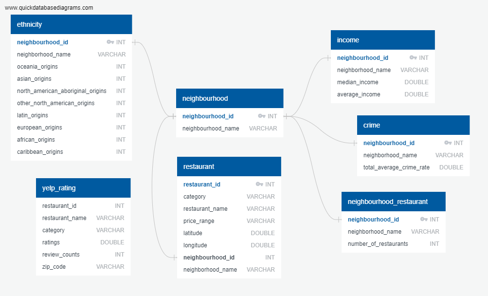
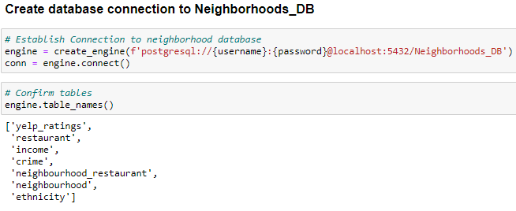
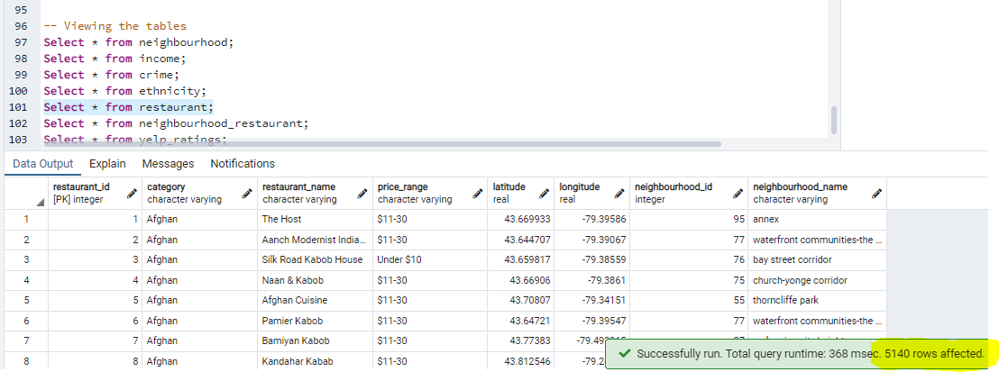
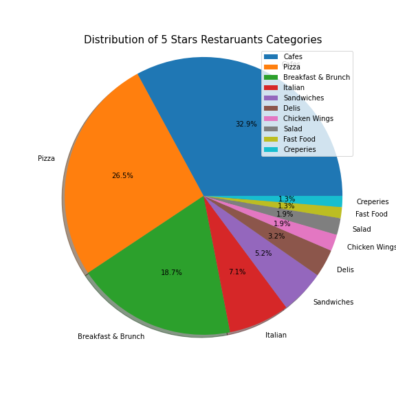

# GTA Restaurant Location Database

**Submitted By:** Dong Yi Kim | Saif Gorges | Saloni Gupta | Sooyeon Kim  
_Date_: December, 17th, 2020\
ETL Project- **Toronto New Restaurant Location Analysis**  

## Table of Contents
  * [Introduction](#introduction)
  * [Data Extraction](#data-extraction)
  * [Data Modeling](#data-modeling)
  * [Data Engineering](#data-engineering)
  * [Data Transformation](#data-transformation)
  * [Load](#load)
  * [Sample Analysis and Insights](#sample-analysis)
  * [Technologies](#technologies)

## Introduction
What are the best neighbourhoods in Toronto to open up a restaurant business? Toronto shelters a large number of ethnicities as compared to other cities in Canada. It is therfore a good idea to start a restaurant in Toronto, however we need to make sure the location we open up in is profitable. Choosing a new restaurant location is an important and difficult decision. Our goal for this project is to create a dashboard page with multiple interactive graphs and maps that give insights into restaurant data as well as neighbourhood information in Toronto. Our goal for this project was to create a database that pulled data from many different sources and perform ETL and ultimately load into Postgres SQL.

## Data Extraction
In this project we extracted, transformed, and loaded these datasets: Toronto Neighbourhood, Income, Crime, Toronto Restaurants Data, Restaurants Ratings. 

* Datasets Sources:
  * Toronto Neighbourhood Data - Toronto City Open Data
  * Toronto Neighbourhood Income - Toronto City Open Data
  * Toronto Crime Data - Toronto City Open Data
  * Toronto Ethnicity Data - Toronto City Open Data Json API
  * Toronto Restaurant Data - Kaggle
  * Restaurant Ratings & number of reviews - Yelp API

## Data Modeling  
ERD (Entity Relationship Diagram) of the tables was sketched out using a tool called 'Quick DBD.'  
  

## Data Engineering  
* Created a table schema for each of the six CSV files using the information and specified data types, primary keys, foreign keys, and other constraints.
* Tables are to be created in the correct order to handle foreign keys.
* Loaded the final tables transformed in jupyter notebook into the corresponding SQL table.
* You can find the table schema sql file here: [table_schema](./ERD/Neighbourhoods-DB-Schema-Tables-Creation.sql)

## Data Transformation
- The CSV files were transfomred by using Pandas in Jupyter Notebook
- Yelp API request for Restaurant rating and Toronto Data json API call for ethnicity data were made in Jupyter Notebook
- Datasets were transformed based on ERD of the tables by using Pandas:
    * Datasets were filtered to have only data needed
    * Unwated columns were removed
    * Some columns were renamed
    * Merged tables if required
    * Duplicated rows and NAN rows were removed when needed
    * Created new columns and assign neighbourhoods using Toronto geometry information and GeoPandas package.

## Load
- The final tables were loaded into a PostgreSQL server by creating Database connection in Jupyter Notebook. 
- Import the module sqlalchemy and create an engine with the parameters user, password, and database name to connect and log in to the PostgreSQL database.  

- Load Final Transformed data into the tables using the to_sql() function with the parameters table name, engine name, if_exists, and index.  
This approach accomplishes data loading in a more direct way, and allows us to add a whole dataframe to a PostgreSQL database all at once.  

- Checked if the tables are successfully populated with data in postgres - Neighbourhoods_DB using the SELECT command. It also shows the number of rows affected successfully.

The final tables are the following: 
- neighbourhood table
- income table
- crime table
- ethnicity table
- restaurant table
- neighbourhood_restaurant table
- yelp_ratings table

- Wrote queries to view the data after joining few tables
  - [Query-joining-Income Crime Ethnicity and number of Restaurants](./ERD/Query-joining-Income-Crime-Ethnicity_Restaurant_number.sql)
  - [Query-joining-Restaurants and Yelp Ratings](./ERD/restaurant_yelp_join_query.sql)

## Sample Analysis

## Technologies
Project was created with:

* Python 3.8
* Jupyter Notebook
* Pandas
* Yelp API
* Toronto City Open Data API
* PostgreSQL
* QucikDBD
* GeoPandas
